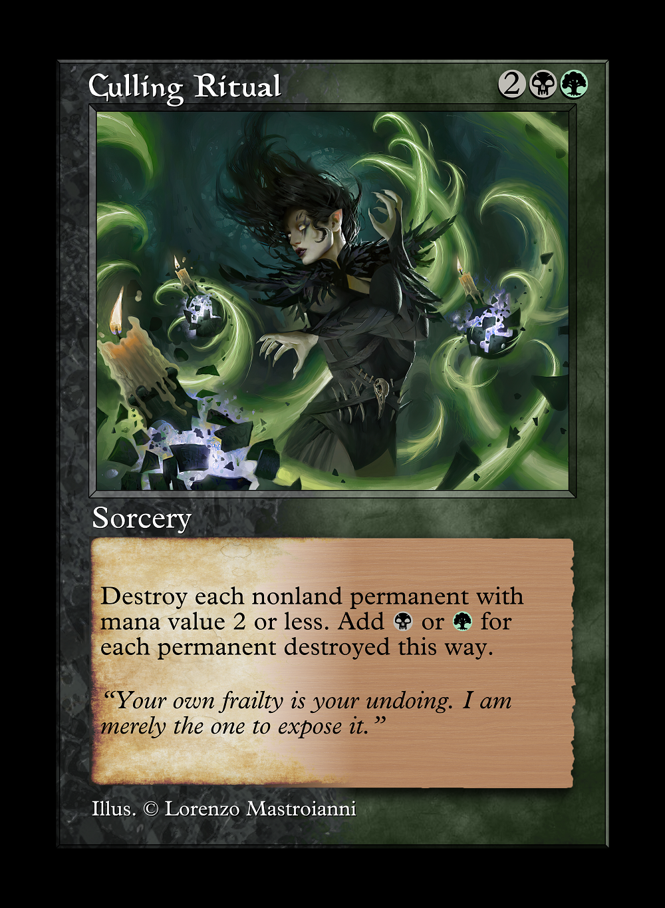

# Drag and drop the folder inside of the "Classic-main" folder into your existing Proximity template directory

## For [Proximity 0.6.1](https://github.com/Proximity-Engine/Proximity/releases/tag/0.6.1)

### If some cards don't render the **text** you just need to change the line 15, from `false` to `true`:

```xml
<ToggleOption id="flavor_bar" default="true"/>
```

### If you want to change the **type** to make for example `Summon Legend` or `Enchant Creature` you need to replace the `${type_line}` variable at the line 647:

```xml
<Text id="back" x="453" y="2608" value="Summon Legend">
```

### If you want to add the **set symbol** you need to add this at the line 644:

```xml
                    <Main id="set_symbol">
                        <Spacer x="2575" y="2470" width="250" height="160"/>
                        <Group>
                            <Selector>
                                <!-- Certain sets don't use a uniform color palette, so this is a necessary evil -->
                                <SVG x="2850" y="2553" src="${rarity}/${proximity.options.set_symbol}" width="242" height="154" horizontal_alignment="end">
                                    <Conditions>
                                        <FileExists src="${rarity}/${proximity.options.set_symbol}.svg"/>
                                    </Conditions>
                                </SVG>
                                <SVG x="2850" y="2553" src="${proximity.options.set_symbol}" width="242" height="154" horizontal_alignment="end">
                                    <Conditions>
                                        <FileExists src="${proximity.options.set_symbol}.svg"/>
                                    </Conditions>
                                </SVG>
                            </Selector>
                            <CardModifier key="proximity.options.set_symbol" value="pz1">
                                <Or>
                                    <Not>
                                        <IsPresent key="proximity.options.set_symbol"/>
                                    </Not>
                                    <Not>
                                        <FileExists src="${proximity.options.set_symbol}.svg"/>
                                    </Not>
                                </Or>
                            </CardModifier>
                            <Conditions>
                                <IsEquals key="proximity.options.show_set_symbol"/>
                            </Conditions>
                        </Group>
                    </Main>
```

### Other errors

I had a little problem with `Deathrite Shaman` where it said that I needed to add a `backgrounds/standard/BG.png` file. I just took any other file in the `backgrounds/standard/` folder, copied it and named it `BG.png` and the error was gone!


